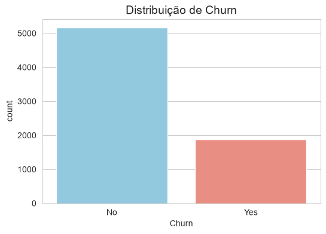
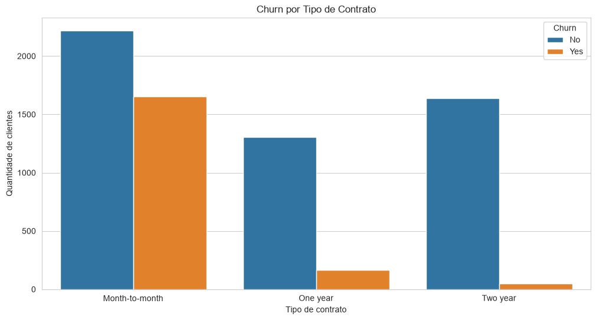
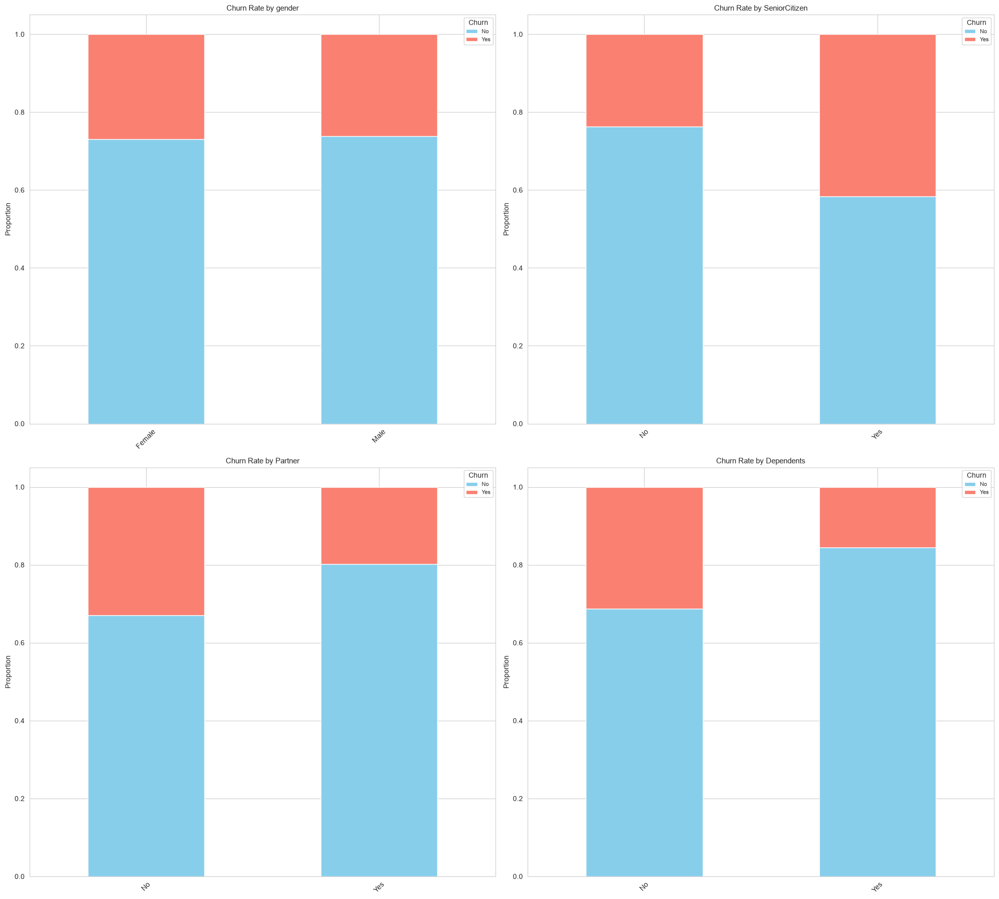
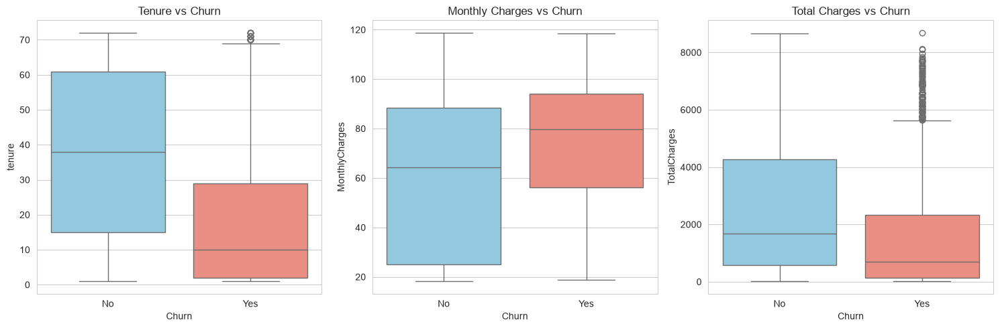
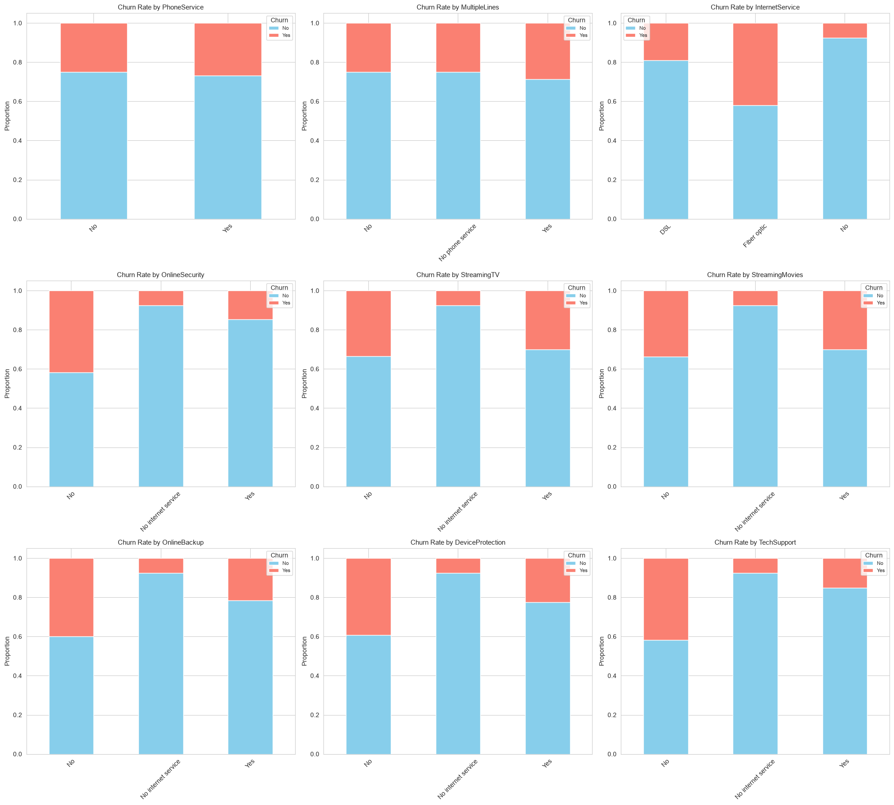

# Telco Customer Churn

## Sumário Executivo 

Este projeto implementa um **pipeline preditivo de Machine Learning**. O modelo analisa o comportamento contratual, financeiro e de consumo de cada cliente para identificar a probabilidade de cancelamento do serviço.

A partir da nossa arquitetura de engenharia de features e da importância matemática dos atributos aprendida pelo classificador (`feature_importances_`).

---
## Fluxo do trabalho

Este trabalho foi realizado seguindo os seguintes passos:
    *  Visualização e descrição básica do dado;
    *  Seleção e transformação das variáveis;
    *  Uso de modelos preditivos;
    *  Avaliação da acurácia e usabilidade do modelo.
---

## Explore: Análise Exploratória dos Dados (EDA)

Antes de qualquer transformação ou modelagem, a etapa de análise exploratória buscou responder três perguntas de negócio:

1. Qual é o perfil de clientes com maior propensão a cancelar o serviço?
2. Quais fatores (tempo de contrato, serviços adicionais, forma de cobrança) estão mais associados ao churn?
3. É possível identificar antecipadamente clientes em risco, orientando ações de retenção?

A base analisada contém **7.032 registros** e **22 variáveis**, cobrindo perfil demográfico, relacionamento contratual, serviços contratados e informações financeiras.

### Distribuição da variável-alvo

| Status | % de Clientes |
|---|---|
| Não cancelaram | 73,4% |
| Cancelaram | 26,6% |


Aproximadamente **1 em cada 4 clientes** da base já cancelou o serviço.

### Achados por dimensão

**Tipo de contrato.** Clientes com contrato mensal (*month-to-month*) apresentam churn significativamente mais alto que clientes com contrato anual ou bianual. 


**Perfil demográfico.** O cliente com maior propensão ao churn é, tipicamente, idoso, sem parceiro(a) e sem dependentes — perfil com menor vínculo familiar no plano e, presumivelmente, menor custo de troca de fornecedor.


**Cobrança mensal (`MonthlyCharges`).** Clientes que cancelam apresentam cobranças mensais mais altas e menos dispersas; clientes que permanecem têm valores mais variados, porém concentrados em faixas mais baixas. 

**Tempo de permanência (`tenure`).** Clientes que cancelam tendem a ter menos tempo de casa, embora existam clientes antigos que também cancelam — tempo de permanência reduz, mas não elimina, o risco.

**Valor total gasto (`TotalCharges`).** Clientes que cancelam gastaram, em geral, menos no acumulado — resultado provavelmente correlacionado a `tenure`, e por isso interpretado em conjunto com o tempo de permanência, e não isoladamente.



**Serviços contratados.** Maior incidência de churn entre clientes com internet via fibra óptica e sem serviços de proteção (`OnlineSecurity`, `OnlineBackup`, `DeviceProtection`, `TechSupport`). Já os serviços de streaming (`StreamingTV`, `StreamingMovies`) não mostraram associação relevante — proporção de churn semelhante entre quem tem e quem não tem.



### Conexão com a etapa de Modelagem

Os fatores identificados na EDA — `tenure`, `MonthlyCharges`, `Contract`, `InternetService` (fibra), e os serviços de proteção (`OnlineSecurity`, `OnlineBackup`, `DeviceProtection`, `TechSupport`) — **coincidem com as variáveis de maior importância** selecionadas algoritmicamente pelo modelo na etapa de Modify (ver seção *Matriz de Impacto* abaixo). Essa convergência entre a leitura exploratória e a seleção estatística de atributos reforça a robustez dos sinais de risco identificados.

---

## Matriz de Impacto: Das Variáveis Selecionadas à Ação de Negócio

Após a etapa de engenharia de features, o conjunto inicial de variáveis foi reduzido para **17 atributos selecionados pelo processo de seleção baseado em importância de features**. Essa redução concentra o modelo nos atributos com maior contribuição acumulada para a capacidade preditiva observada no conjunto de treinamento.

As variáveis selecionadas foram:

```text
MonthlyCharges
tenure
InternetService_Fiber optic
Dependents
gender
Partner
PaperlessBilling
PaymentMethod_Electronic check
OnlineBackup
OnlineSecurity
TechSupport
SeniorCitizen
PaymentMethod_Credit card (automatic)
MultipleLines
Contract_One year
StreamingMovies
DeviceProtection
```

A partir dessas variáveis, a interpretação de negócio deve ser feita como **sinais de risco e hipóteses de intervenção**, e não como evidência de causalidade. O modelo identifica padrões associados à probabilidade de churn; cabe às áreas de Customer Success e Marketing transformar esses sinais em ações e posteriormente validar seu impacto.

| Variável Preditiva Selecionada                                                                   | Interpretação de Negócio ("So What?")                                                                                                                                                                              | Plano de Ação Recomendado (CS / Marketing)                                                                                                                                                             |
| ------------------------------------------------------------------------------------------------ | ------------------------------------------------------------------------------------------------------------------------------------------------------------------------------------------------------------------ | ------------------------------------------------------------------------------------------------------------------------------------------------------------------------------------------------------ |
| **`tenure`** *(Tempo de casa)*                                                                   | O tempo de relacionamento é um dos atributos considerados pelo modelo para diferenciar perfis de risco. Clientes em diferentes estágios da jornada podem apresentar comportamentos distintos de permanência.       | **Onboarding Proativo:** criar réguas de engajamento e check-ins de Customer Success para clientes em início de relacionamento, aumentando a percepção de valor nos primeiros meses.                   |
| **`Contract_One year`**                                                                          | A variável representa clientes com contrato de um ano em relação à categoria de referência do encoding. A estrutura contratual contribui para diferenciar diferentes perfis de risco.                              | **Campanha de Migração:** testar incentivos para clientes de contratos mensais migrarem para planos de maior duração, avaliando retenção e impacto financeiro.                                         |
| **`InternetService_Fiber optic`**                                                                | A utilização de fibra óptica aparece entre os atributos selecionados pelo modelo, indicando que o tipo de serviço contém informação relevante para diferenciar perfis de clientes.                                 | **Monitoramento de Experiência:** investigar satisfação, chamados técnicos e percepção de valor de clientes de fibra antes de definir ações específicas de retenção.                                   |
| **`TechSupport`**                                                                                | A disponibilidade de suporte técnico está entre as variáveis selecionadas, indicando que esse atributo contém informação útil para a classificação de risco.                                                       | **Suporte Proativo:** para clientes identificados como alto risco, testar onboarding técnico, contato preventivo ou benefícios relacionados ao suporte.                                                |
| **`MonthlyCharges`**                                                                             | O valor da cobrança mensal é um dos atributos selecionados e pode representar diferenças de perfil e exposição financeira entre os clientes.                                                                       | **Retenção por Valor:** para clientes de alto risco, avaliar alternativas de plano, benefícios ou condições comerciais antes de oferecer descontos indiscriminadamente.                                |
| **`PaymentMethod_Electronic check`**                                                             | O método de pagamento eletrônico está entre as variáveis selecionadas, indicando que a forma de cobrança ajuda a diferenciar os perfis de churn.                                                                   | **Automação de Pagamento:** testar campanhas de migração para métodos de pagamento automáticos, medindo impacto sobre churn e inadimplência.                                                           |
| **`PaymentMethod_Credit card (automatic)`**                                                      | O pagamento automático por cartão também foi selecionado pelo modelo, permitindo diferenciar comportamentos associados aos métodos de cobrança.                                                                    | **Incentivo à Recorrência:** estimular formas de pagamento automático quando houver benefício econômico e operacional comprovado.                                                                      |
| **`Contract_One year`**** + ****`MonthlyCharges`**** + ****`tenure`**                            | A combinação de características contratuais, financeiras e de relacionamento permite ao modelo construir um perfil individual de risco mais completo.                                                              | **Segmentação por Risco:** combinar o score de churn com características do cliente para definir campanhas específicas, em vez de aplicar uma única estratégia para toda a carteira.                   |
| **`OnlineSecurity`****, ****`OnlineBackup`****, ****`DeviceProtection`**** e ****`TechSupport`** | O conjunto de serviços adicionais selecionados indica que a composição do pacote contratado contém informação relevante para diferenciar perfis de clientes.                                                       | **Revisão do Bundle:** testar ofertas de serviços adicionais ou suporte para segmentos de alto risco, priorizando intervenções com potencial de aumentar o valor percebido.                            |
| **`Dependents`****, ****`Partner`**** e ****`SeniorCitizen`**                                    | Essas variáveis representam características demográficas e familiares utilizadas pelo modelo para diferenciar perfis de risco.                                                                                     | **Segmentação de Comunicação:** utilizar essas informações para personalizar comunicação e ofertas, respeitando políticas de privacidade e sem interpretar essas características como causas do churn. |
| **`gender`**                                                                                     | A variável foi selecionada pelo processo de modelagem, indicando que contém informação preditiva no conjunto analisado. Entretanto, sua utilização exige cuidado para evitar decisões comerciais discriminatórias. | **Governança:** utilizar a variável para avaliação estatística e auditoria do modelo, evitando transformá-la diretamente em critério de priorização comercial sem análise de fairness.                 |
| **`MultipleLines`**** e ****`StreamingMovies`**                                                  | Esses atributos representam características do pacote e do consumo do cliente e foram considerados relevantes pelo processo de seleção.                                                                            | **Personalização de Oferta:** avaliar se mudanças no pacote, benefícios de uso ou ofertas complementares reduzem o risco dos segmentos identificados.                                                  |
| **`PaperlessBilling`**                                                                           | A modalidade de faturamento digital foi selecionada como atributo preditivo, contribuindo para diferenciar os perfis avaliados pelo modelo.                                                                        | **Jornada de Cobrança:** investigar a relação entre experiência de faturamento, pagamento e retenção antes de definir uma intervenção específica.                                                      |

A seleção das **17 features** indica que esses atributos apresentaram contribuição suficiente para permanecer no conjunto utilizado pelo modelo.

O modelo deve ser utilizado como uma **ferramenta de priorização de risco**, e não como uma explicação causal do comportamento do cliente.

O objetivo final não é apenas obter uma boa **ROC-AUC**, mas utilizar o score de risco para:

* **priorizar clientes** com maior probabilidade estimada de churn;
* **direcionar ações** de Customer Success e Marketing;
* **testar hipóteses de retenção** por meio de intervenções controladas;
* **medir o impacto financeiro** das ações realizadas;
* **avaliar churn efetivamente evitado**, e não apenas a capacidade preditiva do modelo.

---

## Metodologia & Engenharia do Pipeline

1. **Prevenção de Vazamento de Dados (Data Leakage):**
   * Isolamento do conjunto de teste: 20% dos dados são reservados para avaliação final antes do treinamento do modelo. A separação é estratificada pelo alvo. Como melhoria de engenharia, o preprocessing categórico pode ser encapsulado em um Pipeline para garantir que transformações aprendidas sejam ajustadas exclusivamente sobre o conjunto de treino.
   * Além disso, isolamos um **conjunto cego de 10 linhas em arquivo externo (`ultimas_10_linhas.csv`)** para simular o processo de inferência real (`predict.py`) sem contaminação do histórico.
2. **Eliminação de Multicolinearidade via Dummy Encoding:**
   * Aplicamos o One-Hot Encoding (`pd.get_dummies`) com o parâmetro `drop_first=True`. Isso converte categorias complexas em binários sem redundância matemática (ex.: se o cliente tem 0 em `Contract_One year` e `Contract_Two year`, o modelo infere com 100% de precisão que ele pertence ao contrato Mensal).
3. **Otimização via Métrica ROC-AUC (Datasets Desbalanceados):**
   * Em cenários de Churn onde a maioria dos clientes permanece no serviço, a métrica de Acurácia é enganosa (prever "todos ficam" daria alta acurácia ilusória).
   * O pipeline utiliza `GridSearchCV` parametrizado para maximizar a **ROC-AUC**, obrigando o modelo a separar com máxima precisão as classes de risco em thresholds probabilísticos confiáveis.
4. **Seleção Algorítmica de Atributos (`best_features`):**
   * Antes de ajustar o classificador principal, utilizamos uma árvore de decisão de baseline (`DecisionTreeClassifier`) para calcular a importância de Gini das features no conjunto de treino. Aplicamos um filtro de **importância acumulada inferior a 96%** para selecionar as variáveis mais explicativas (`best_features`). Essa abordagem automatizada reduz ruídos, otimiza o tempo de processamento e simplifica a interpretação do modelo final.
5. **Governança & Rastreabilidade com MLflow:**
   * Todos os parâmetros de experimentação, acurácias, métricas ROC-AUC e versões dos modelos serializados (`model.pkl`) são rastreados de forma centralizada pelo servidor MLflow.

---

## Resultados do Modelo e Métricas Executivas

Em vez de avaliarmos o modelo apenas por acurácia simples — métrica que pode ser altamente enganosa quando lidamos com dados desbalanceados —, utilizamos a **Área Sob a Curva ROC (ROC-AUC)** como nossa principal métrica de performance (North Star metric).

Os modelos de **Regressão Logística** e **Random Forest** foram testados e avaliados com as métricas de Acurácia e ROC-AUC. Devido ao seu melhor desempenho, embora mais lento, o modelo de Floresta Aleatória foi escolhido.

| Partição | Acurácia | ROC-AUC |
| :--- | :---: | :---: |
| **Treino** | *0.8227* | *0.8844* |
| **Teste** | *0.7981* | *0.8398* |

*Nota: O modelo apresenta boa generalização, com métricas de treino e teste próximas, o que sugere ausência de overfitting relevante, resultado do rigor no isolamento dos dados e na seleção de features.*

## Arquitetura e Organização do Repositório

O projeto é separado em rotinas modulares de preparação, treinamento e inferência:

```text
├── data/
│   ├── raw/telco_info.csv        # Histórico original em lote
│   └── ultimas_10_linhas.csv     # Amostra cega para simulação de inferência
├── models/
│   └── model.pkl                 # Pipeline preditivo serializado com as melhores features
├── src/
│   ├── train.py                  # Processamento, GridSearchCV, Seleção de Variáveis e Log MLflow
│   └── predict.py                # Leitura do MLflow Registry e Scoring de Probabilidade
└── README.md                     # Documentação de Negócios e Engenharia
```
